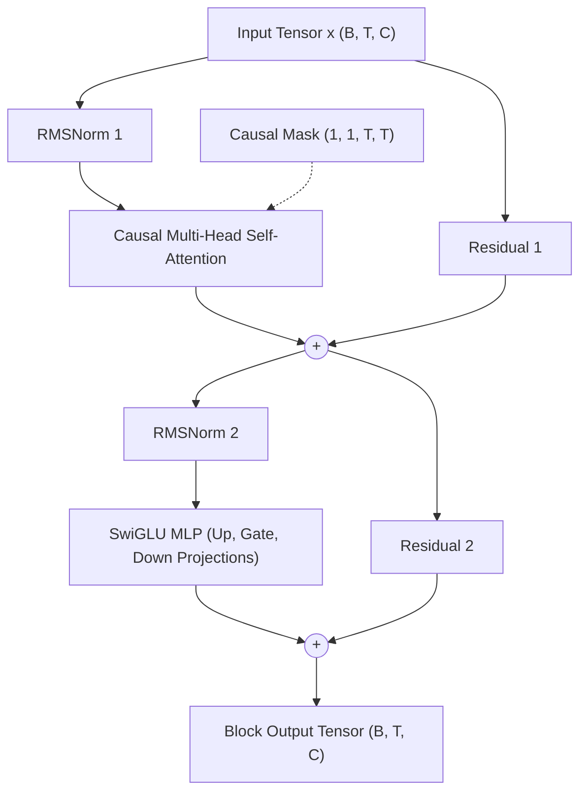
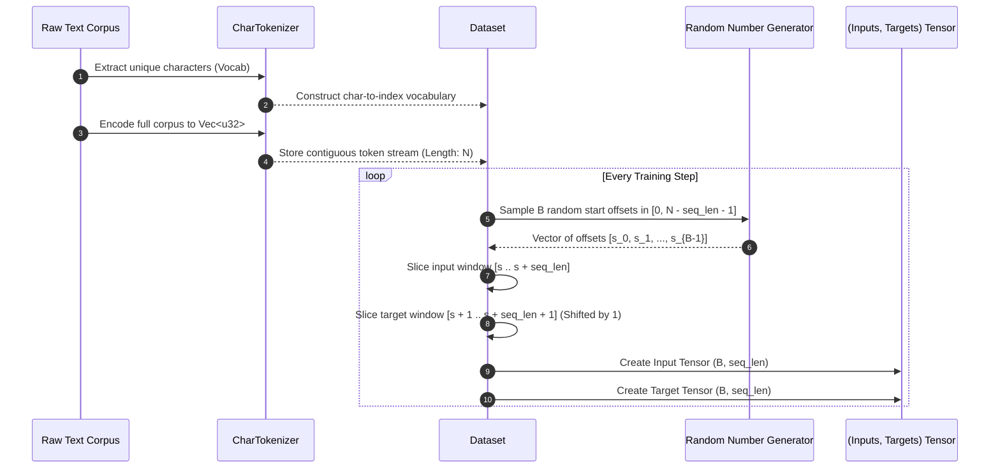
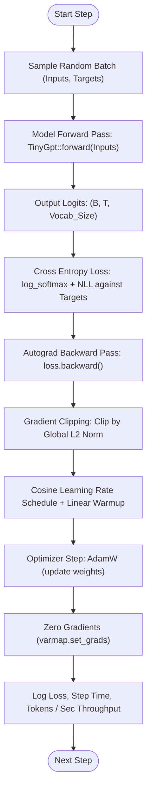
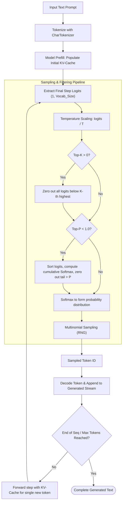
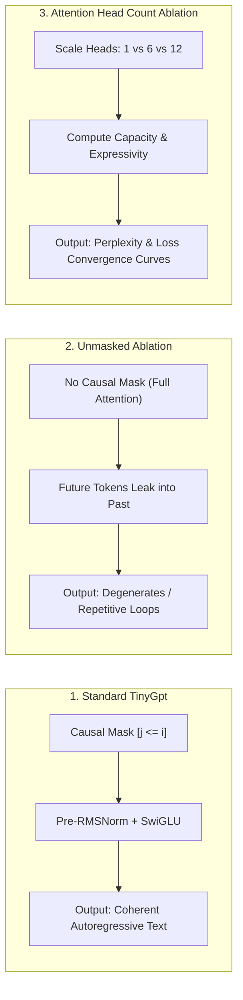

# tinygpt-rs (nini)

[](https://www.rust-lang.org/)
[](https://github.com/huggingface/candle)
[](https://developer.nvidia.com/cuda-toolkit)
[](LICENSE)

A decoder-only autoregressive transformer built **completely from scratch in Rust** using Hugging Face's [`candle`](https://github.com/huggingface/candle) tensor and autograd engine.

> **Zero Prebuilt Models. Zero Black-Box Attention.**  
> Every component—from multi-head causal self-attention, RMSNorm, and SwiGLU feed-forward networks, to the stateful KV-cache, causal batching, and nucleus sampling—is hand-composed from tensor primitives to demonstrate transparent transformer mechanics.

---

## Table of Contents

1. [Architecture Overview](#architecture-overview)
2. [Architectural Wireframes](#architectural-wireframes)
   - [1. Macro Model Pipeline](#1-macro-model-pipeline)
   - [2. Transformer Decoder Block Wireframe](#2-transformer-decoder-block-wireframe)
   - [3. Hand-Composed Causal Multi-Head Attention Wireframe](#3-hand-composed-causal-multi-head-attention-wireframe)
   - [4. Autoregressive KV-Cache Wireframe](#4-autoregressive-kv-cache-wireframe)
3. [System Workflows](#system-workflows)
   - [Workflow 1: Tokenization & Random-Chunk LM Batching](#workflow-1-tokenization--random-chunk-lm-batching)
   - [Workflow 2: Training Loop & Autograd Optimization](#workflow-2-training-loop--autograd-optimization)
   - [Workflow 3: Autoregressive Inference & Sampling Pipeline](#workflow-3-autoregressive-inference--sampling-pipeline)
   - [Workflow 4: Architectural Ablation Study](#workflow-4-architectural-ablation-study)
4. [Tensor Dimension Flow](#tensor-dimension-flow)
5. [Project Structure](#project-structure)
6. [Quick Start & Usage](#quick-start--usage)
   - [Prerequisites](#prerequisites)
   - [Running Tests](#running-tests)
   - [Training & Inference](#training--inference)
7. [Design Principles](#design-principles)
8. [License](#license)

---

## Architecture Overview

`tinygpt-rs` implements a modern decoder-only language model (incorporating modern architectural choices found in LLaMA and Mistral):

- **Tokenizer**: Pure character-level tokenizer mapping bytes/characters into deterministic discrete vocabulary IDs without third-party dependencies.
- **Embeddings**: Sum of learned token embeddings and learned positional embeddings.
- **Pre-Normalization**: Root Mean Square Layer Normalization ([`RMSNorm`](src/norm.rs)) applied before attention and MLP sub-layers.
- **Hand-Composed Self-Attention**: Independent Linear $Q$, $K$, $V$ projections, multi-head reshaping, scaled dot-product attention with an upper-triangular causal $-\infty$ mask, followed by an output projection.
- **SwiGLU Activation**: Gated multi-layer perceptron with Swish/SiLU non-linearity: $\text{SwiGLU}(x) = (\text{Linear}_{\text{gate}}(x) \odot \text{SiLU}(\text{Linear}_{\text{up}}(x))) \cdot \text{Linear}_{\text{down}}$.
- **Inference KV-Cache**: Stateful key/value caching per layer converting incremental autoregressive token generation from $O(T^2)$ to $O(1)$ computation per step.
- **Advanced Sampling**: Temperature scaling, Top-$K$ truncation, and Top-$P$ (Nucleus) cumulative probability filtering.

---

## Architectural Wireframes

### 1. Macro Model Pipeline

```
                     ┌───────────────────────────────────────┐
                     │          Raw Character Input          │
                     │          "To be, or not to be"        │
                     └───────────────────┬───────────────────┘
                                         │
                                         ▼
                     ┌───────────────────────────────────────┐
                     │         Char-Level Tokenizer          │
                     │          Indices: [20, 15, 1, 3, ...] │
                     └───────────────────┬───────────────────┘
                                         │  (Batch, Seq_Len)
                                         ▼
                     ┌───────────────────────────────────────┐
                     │          Embedding Assembly           │
                     │  ┌─────────────────┐ ┌──────────────┐ │
                     │  │ Token Embedding │+│ Pos Embedding│ │
                     │  └─────────────────┘ └──────────────┘ │
                     └───────────────────┬───────────────────┘
                                         │  (B, T, Hidden_Dim)
                                         ▼
                   ┌───────────────────────────────────────────┐
                   │        Decoder Stack (x N Layers)         │
                   │  ┌─────────────────────────────────────┐  │
                   │  │         Decoder Block 0             │  │
                   │  ├─────────────────────────────────────┤  │
                   │  │         Decoder Block 1             │  │
                   │  ├─────────────────────────────────────┤  │
                   │  │         Decoder Block ...           │  │
                   │  ├─────────────────────────────────────┤  │
                   │  │         Decoder Block (N - 1)       │  │
                   │  └─────────────────────────────────────┘  │
                   └─────────────────────┬─────────────────────┘
                                         │  (B, T, Hidden_Dim)
                                         ▼
                     ┌───────────────────────────────────────┐
                     │             Final RMSNorm             │
                     └───────────────────┬───────────────────┘
                                         │  (B, T, Hidden_Dim)
                                         ▼
                     ┌───────────────────────────────────────┐
                     │        Linear LM Head Projection      │
                     └───────────────────┬───────────────────┘
                                         │  (B, T, Vocab_Size)
                                         ▼
                     ┌───────────────────────────────────────┐
                     │             Output Logits             │
                     └───────────────────────────────────────┘
```

---

### 2. Transformer Decoder Block Wireframe

Each decoder block operates with pre-normalization and residual additive skip connections:

```
            Input Tensor x: (Batch, Seq_Len, Hidden_Dim)
                          │
            ┌─────────────┴─────────────┐
            │ [Residual Branch 1]       │
            │                           ▼
            │                   ┌──────────────┐
            │                   │   RMSNorm    │
            │                   └───────┬──────┘
            │                           ▼
            │                   ┌──────────────┐  Causal Mask
            │                   │ Causal MHA   │◄────────────
            │                   └───────┬──────┘
            │                           │
            ▼                           ▼
          ( + ) ◄───────────────────────┘
            │
            ├───────────────────────────┐
            │ [Residual Branch 2]       │
            │                           ▼
            │                   ┌──────────────┐
            │                   │   RMSNorm    │
            │                   └───────┬──────┘
            │                           ▼
            │                   ┌──────────────┐
            │                   │  SwiGLU MLP  │
            │                   └───────┬──────┘
            │                           │
            ▼                           ▼
          ( + ) ◄───────────────────────┘
            │
            ▼
    Block Output Tensor: (Batch, Seq_Len, Hidden_Dim)
```

#### Decoder Block Architecture (Mermaid)



---

### 3. Hand-Composed Causal Multi-Head Attention Wireframe

Attention is explicitly factored into separate linear projections, multi-head splits, dot-product scoring, causal masking, and head re-assembly:

```
                      Input x (B, T, C)
                              │
         ┌────────────────────┼────────────────────┐
         ▼                    ▼                    ▼
   ┌───────────┐        ┌───────────┐        ┌───────────┐
   │ Q_Linear  │        │ K_Linear  │        │ V_Linear  │
   └─────┬─────┘        └─────┬─────┘        └─────┬─────┘
         │ (B, T, C)          │ (B, T, C)          │ (B, T, C)
         ▼                    ▼                    ▼
   ┌───────────┐        ┌───────────┐        ┌───────────┐
   │ Reshape & │        │ Reshape & │        │ Reshape & │
   │ Transpose │        │ Transpose │        │ Transpose │
   └─────┬─────┘        └─────┬─────┘        └─────┬─────┘
         │ (B, H, T, D)       │ (B, H, T, D)       │ (B, H, T, D)
         │                    ▼                    │
         │             ┌──────────────┐            │
         │             │ Transpose K  │            │
         │             │ (B, H, D, T) │            │
         │             └──────┬───────┘            │
         ▼                    ▼                    │
      ┌───────────────────────────┐                │
      │   Batch MatMul: Q @ K^T   │                │
      │        (B, H, T, T)       │                │
      └─────────────┬─────────────┘                │
                    ▼                              │
      ┌───────────────────────────┐                │
      │  Scale by 1 / sqrt(D_h)   │                │
      └─────────────┬─────────────┘                │
                    ▼                              │
      ┌───────────────────────────┐  Causal Mask   │
      │  Add Upper-Tri Mask (-inf)│◄─── [0  -inf]  │
      └─────────────┬─────────────┘     [0    0 ]  │
                    ▼                              │
      ┌───────────────────────────┐                │
      │       Softmax(dim=-1)     │                │
      │    Weights: (B, H, T, T)  │                │
      └─────────────┬─────────────┘                │
                    ▼                              ▼
      ┌──────────────────────────────────────────────┐
      │          Batch MatMul: Weights @ V           │
      │                 (B, H, T, D)                 │
      └─────────────────────┬────────────────────────┘
                            ▼
      ┌──────────────────────────────────────────────┐
      │        Transpose & Merge Heads (B, T, C)     │
      └─────────────────────┬────────────────────────┘
                            ▼
      ┌──────────────────────────────────────────────┐
      │          Output Projection: O_Linear         │
      └─────────────────────┬────────────────────────┘
                            ▼
                    Output (B, T, C)
```

---

### 4. Autoregressive KV-Cache Wireframe

During inference, previously computed keys and values are retained in memory. When a new token arrives at step $t$, only the single new token vector is projected, avoiding redundant $O(T^2)$ recomputations:

```
Prefill Phase (Step t=0..T-1):
  Tokens [w_0, w_1, ..., w_{T-1}]
  Compute K_0..T-1, V_0..T-1 ──────────────────────► Store in KV-Cache
  Output token w_T

Decode Step (t=T):
  Single Token Input: [w_T] (Shape: 1, 1)
            │
            ▼
  ┌───────────────────┐
  │ Project Q, K, V   │ ===> q_new (1, 1, H, D), k_new (1, 1, H, D), v_new (1, 1, H, D)
  └─────────┬─────────┘
            │
            ├──────────────────────────┐
            ▼                          ▼
  ┌───────────────────┐      ┌───────────────────┐
  │  Cached Past K    │      │  Cached Past V    │
  │  Shape: (1, T, ..)│      │  Shape: (1, T, ..)│
  └─────────┬─────────┘      └─────────┬─────────┘
            ▼                          ▼
      Concatenate                Concatenate
  ┌───────────────────┐      ┌───────────────────┐
  │ Complete Keys K   │      │ Complete Values V │
  │ Shape: (1, T+1, ..│      │ Shape: (1, T+1, ..│
  └─────────┬─────────┘      └─────────┬─────────┘
            └────────────┬─────────────┘
                         ▼
        ┌────────────────────────────────┐
        │ Scaled Dot-Product Attention   │
        │      q_new @ K^T -> (1, 1, T+1)│
        │    Softmax @ V   -> (1, 1, D)  │
        └────────────────┬───────────────┘
                         ▼
             Emit Next Token: w_{T+1}
```

---

## System Workflows

### Workflow 1: Tokenization & Random-Chunk LM Batching

Batches are constructed without padding by sampling random continuous sequence windows from the tokenized corpus:



---

### Workflow 2: Training Loop & Autograd Optimization



---

### Workflow 3: Autoregressive Inference & Sampling Pipeline



---

### Workflow 4: Architectural Ablation Study

Demonstrates verifiable structural understanding by evaluating performance and generative characteristics under controlled degradations:



---

## Tensor Dimension Flow

Tracking tensor rank and shapes throughout the pipeline:

| Stage / Component | Operation | Input Shape | Output Shape |
| :--- | :--- | :--- | :--- |
| **Token Sequence** | Tokenizer Encoding | String (Length $T$) | `(B, T)` |
| **Embeddings** | Token Emb + Pos Emb | `(B, T)` | `(B, T, C)` |
| **RMSNorm** | Root Mean Square Normalization | `(B, T, C)` | `(B, T, C)` |
| **Linear Projections** | Linear $Q, K, V$ Projections | `(B, T, C)` | `(B, T, C)` each |
| **Multi-Head Split** | Reshape & Transpose | `(B, T, C)` | `(B, H, T, D_h)` |
| **Attention Scores** | $Q \cdot K^T / \sqrt{D_h}$ | `(B, H, T, D_h)` $\times$ `(B, H, D_h, T)` | `(B, H, T, T)` |
| **Causal Mask** | Broadcast Add Upper Triangular $-\infty$ | `(B, H, T, T)` + `(1, 1, T, T)` | `(B, H, T, T)` |
| **Attention Weights**| Softmax across last dim | `(B, H, T, T)` | `(B, H, T, T)` |
| **Attention Context**| Weights $\cdot V$ | `(B, H, T, T)` $\times$ `(B, H, T, D_h)` | `(B, H, T, D_h)` |
| **Merge Heads** | Transpose & Reshape | `(B, H, T, D_h)` | `(B, T, C)` |
| **Attention Output** | Linear $O$ Projection | `(B, T, C)` | `(B, T, C)` |
| **Residual Add 1** | $x + \text{Attention}(x)$ | `(B, T, C)` + `(B, T, C)` | `(B, T, C)` |
| **SwiGLU MLP** | $\text{Down}(\text{Gate}(x) \cdot \text{SiLU}(\text{Up}(x)))$ | `(B, T, C)` | `(B, T, C)` |
| **Residual Add 2** | $x + \text{MLP}(x)$ | `(B, T, C)` + `(B, T, C)` | `(B, T, C)` |
| **Final RMSNorm** | Normalization before head | `(B, T, C)` | `(B, T, C)` |
| **Language Head** | Linear Projection to Vocabulary | `(B, T, C)` | `(B, T, V)` |

*Dimensions legend: $B$ = Batch Size, $T$ = Sequence Length, $C$ = Hidden Size ($384$), $H$ = Number of Heads ($6$), $D_h = C / H$ = Head Dimension ($64$), $V$ = Vocabulary Size ($65$ for char Shakespeare).*

---

## Project Structure

```
tinygpt-rs/
├── Cargo.toml                              # Package manifest with optional CUDA feature
├── Cargo.lock                              # Dependency lockfile
├── LICENSE                                 # MIT License
├── README.md                               # Architectural guide, wireframes, and workflows
├── docs/
│   └── superpowers/
│       ├── specs/2026-09-17-tinygpt-rs-design.md   # Architectural design specification
│       └── plans/2026-09-17-tinygpt-rs.md          # Step-by-step implementation plan
└── src/
    ├── lib.rs                              # Library root & public re-exports
    ├── config.rs                           # ModelConfig & hyperparameter definitions
    ├── tokenizer.rs                        # Pure-Rust char-level tokenizer
    ├── norm.rs                             # Custom RMSNorm implementation
    ├── attention.rs                        # Hand-composed Causal Multi-Head Attention & mask
    ├── mlp.rs                              # SwiGLU feed-forward network
    ├── block.rs                            # Transformer Decoder Block with residual wiring
    ├── model.rs                            # Full TinyGpt core architecture
    ├── kv_cache.rs                         # Custom Key-Value cache implementation
    ├── sampling.rs                         # Temperature, Top-K, and Top-P (Nucleus) sampling
    ├── data.rs                             # Dataset loader & random-chunk LM batching
    ├── train.rs                            # Training loop, AdamW optimizer, LR scheduler
    └── generate.rs                         # Autoregressive generation & ablation runner
```

---

## Quick Start & Usage

### Prerequisites

- **Rust toolchain** (1.80+ or 2024 edition).
- (Optional for GPU) **NVIDIA GPU & CUDA Toolkit** (`nvcc` and driver compatible with CUDA 12).

### Running Tests

All mathematical invariants, tensor shapes, causal masking rules, and regression tests run on CPU out of the box:

```bash
# Run all unit and integration tests
cargo test

# Run tests with output printed
cargo test -- --nocapture
```

Key unit test verifications include:
- `mask_gives_zero_weight_to_future_tokens`: Verifies future attention weights are strictly zero after softmax.
- `logits_shape_uses_actual_length_not_configured_seq_len`: Verifies dynamic sequence handling.
- `targets_are_inputs_shifted_by_one`: Validates causal LM next-token alignment.

### Building with CUDA Acceleration

For high-throughput GPU training and generation on NVIDIA hardware:

```bash
# Build optimized binary with CUDA enabled
cargo build --release --features cuda
```

### Training & Inference

```bash
# Train on tiny-Shakespeare using CUDA
cargo run --release --features cuda -- train \
  --data data/tinyshakespeare.txt \
  --batch-size 32 \
  --seq-len 256 \
  --epochs 10

# Generate text with KV-Cache and Nucleus Sampling
cargo run --release --features cuda -- generate \
  --prompt "First Citizen:" \
  --max-tokens 200 \
  --temperature 0.8 \
  --top-p 0.95
```

---

## Design Principles

1. **Explicit Over Implicit**: Every attention equation, reshaping operation, and residual summation is written line-by-line. No opaque wrapper libraries.
2. **First-Class GPU Acceleration**: Developed natively to compile with `candle-core/cuda` and run on consumer NVIDIA GPUs (tested on RTX 4050 6GB VRAM).
3. **Reproducible & Testable**: Automated testing covers tensor bounds, head dimension divisibility, causal mask zeros, and target shifting.

---

## License

This project is licensed under the [MIT License](LICENSE).
